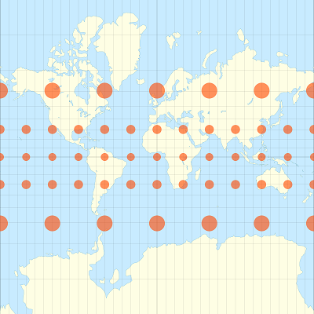
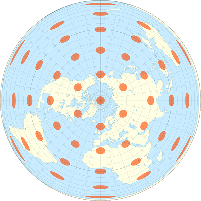
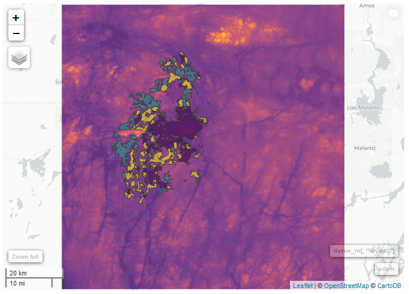

```{r setup, include=FALSE}
knitr::opts_chunk$set(echo = TRUE, collapse = TRUE)
```

---

Cet atelier se veut un survol des outils disponibles en R pour l'analyse de données géoréférencées. Ce type de données apparaît de plus en plus fréquemment dans divers domaines (ex.: photos aériennes, images satellite, données du recensement, lieux rattachés aux messages sur les réseaux sociaux, etc.). Il existe deux grandes catégories de données géoréférencées: les données matricielles représentent des variables définies à chaque point d'une grille couvrant tout l'espace représenté (comme une image satellite), tandis que les données vectorielles associent des variables à des objets géométriques placés à des endroits précis (comme la position des villes et des chemins sur une carte routière).

Au départ, l'utilisation de commandes de programmation pour manipuler des données géographiques peut sembler moins intuitif que l'interface graphique de logiciels spécialisés (ex.: ArcGIS). Voici quelques avantages d'une analyse programmée:

* Il est facile de répéter l'analyse pour de nouvelles données en ré-exécutant le programme.
* Il est facile pour d'autres chercheurs de reproduire la méthodologie s'ils ont accès au même langage de programmation.
* Dans le cas spécifique de R, on peut extraire des variables spatiales et les combiner à d'autres analyses statistiques avec un seul programme.


## Objectifs

* Se familiariser avec les principaux packages permettant le traitement et la visualisation simple de données vectorielles (***sf***) et matricielles (***raster***) en R. 
* Effectuer des transformations de données courantes à l'aide des fonctions de ces packages.
* Connaître certains packages permettant des visualisations plus complexes: ***tmap*** pour des cartes statiques et ***mapview*** pour des cartes interactives.


## Table des matières

* [Explorer un jeu de données vectoriels](#vect)
* [Systèmes de coordonnées et transformations](#crs)
* [Opérations géométriques sur les données vectorielles](#vectop)
* [Cartes thématiques avec *tmap*](#tmap)
* [Traitement des données matricielles](#mat)
* [Extraire des données matricielles à partir d'objets géométriques](#ext)
* [Cartes interactives avec *mapview*](#mapview)
* [Références](#ref)
* [Solutions des exercices](#sol)

---

## Explorer un jeu de données vectoriel {#vect}

Le répertoire *mrc* contient les coordonnées des municipalités régionales de comté (MRC) du Québec en format *ESRI shapefile* ([source originale des données](https://www.mern.gouv.qc.ca/territoire/portrait/portrait-donnees-mille.jsp)). Notez que l'information pour chaque jeu de données est contenue dans plusieurs fichiers, qui portent le même nom mais diffèrent par leur extension. 

Pour charger un jeu de données dans R, nous appelons la fonction `st_read` (toutes les fonctions du package ***sf*** ont le préfixe `st_`, pour spatiotemporel) avec le nom du fichier *.shp*.


```{r read_mrc}
library(sf)

mrc <- st_read("mrc/mrc_polygone.shp", stringsAsFactors = FALSE)
```

Le texte de sortie indique certaines propriétés du jeu de données chargé, incluant le type de géométrie (POLYGON), les limites spatiales du jeu de données (*bbox*) et le système de coordonnées utilisé. Ce dernier est décrit sous deux formats: un code numérique *epsg* et une chaîne de caractère *proj4string*. Nous traiterons davantage des systèmes de coordonnées plus loin.

Ces propriétés peuvent être extraites séparément à l'aide des fonctions `st_bbox` et `st_crs`:
```{r bbox_crs}
st_bbox(mrc)
st_crs(mrc)
```

Regardons un aperçu du jeu de données:
```{r class_head}
class(mrc)
head(mrc)
```

Un objet de classe `sf` est en fait un `data.frame` spécialisé, où chaque ligne contient des champs de données qui sont associés à un objet géométrique, décrit dans la colonne `geometry`. Les types géométriques les plus courants sont:

* POINT: Coordonnées (*x*, *y*) d'un point.
* LINESTRING: Séquence de points reliés par des segments de droite.
* POLYGON: Séquence de points formant un polygone simple fermé.
* MULTIPOINT, MULTILINESTRING ou MULTIPOLYGON: Jeu de données où chaque objet peut être composé de plusieurs points ou lignes ou polygones.


La fonction `plot` appliquée à un objet `sf` crée une carte de chaque attribut du jeu de données.

```{r plot_sf}
plot(mrc)
```

Pour n'afficher qu'un attribut, il faut sélectionner la colonne correspondante. Pour n'afficher que la carte sans données, on peut choisir la colonne `geometry`. Le paramètre `axes = TRUE` indique au programme d'afficher les axes de coordonnées.

```{r plot_geom}
plot(mrc[, "geometry"], axes = TRUE)
```

### Exercice 1 {#retour1}

Produisez une carte coloriée par région administrative, ex.: Nord-du-Québec, Côte-Nord, etc.

[Solution](#sol1)

---

La fonction `st_as_sf` permet de convertir un `data.frame` contenant des coordonnées géographiques en objet `sf`. Il suffit de spécifier les colonnes contenant les coordonnées ainsi que le système de coordonnées utilisé.

Ici, créons un jeu de données d'un seul point correspondant à la position de l'UQAT, avec le même système de coordonnées que `mrc` (longitude et latitude).

```{r create_pt}
uqat <- data.frame(nom = "UQAT", long = -79.0086, lat = 48.2306)
uqat <- st_as_sf(uqat, coords = c("long", "lat"), crs = st_crs(mrc))
```

Le package ***sf*** inclut différentes fonctions de comparaison entre données géométriques. Pour déterminer quel polygone de `mrc` contient le point `uqat`, on utilise la fonction `st_within`:
```{r within}
st_within(uqat, mrc)
```

L'avertissement nous rappelle que les opérations géométriques de ce package sont basées sur un plan *xy* plutôt que des coordonnées sphériques (plus de détails ci-dessous). 

Le résultat d'une comparaison entre deux jeux de données géométriques est une liste qui, pour chaque objet du premier jeu de données, contient les indices des objets du deuxième jeu de données auxquels la relation s'applique. Donc ici, le point 1 (et seul point) dans `uqat` est contenu (*within*) dans le polygone 56 de `mrc`. On peut vérifier de quelle MRC il s'agit: 
```{r mrc56}
mrc[56, ]
```

Pour afficher différents jeux de données sur la même carte, on appelle d'abord `plot` avec le paramètre `reset = FALSE`, puis on ajoute un autre jeu de données avec le paramètre `add = TRUE`. 

```{r plot_overlap}
plot(mrc[, "geometry"], reset = FALSE, axes = TRUE)
plot(uqat, add = TRUE, pch = 20, col = "red")
```

**Rappel**

* Les données spatiales vectorielles associent des champs de donnés à des objets géométriques tels que des points, lignes et polygones. Le package ***sf*** permet de travailler avec ces données dans R.
* Pour lire un jeu de données vectoriel: `st_read`.
* Pour convertir un jeu de données standard (`data.frame`) en objet spatial: `st_as_sf`.
* Toutes les opérations de base des objets `data.frame` s'appliquent aussi aux objets *sf*.
* La fonction `plot` appliquée à un objet `sf` permet d'afficher un ou plusieurs champs de données sur une carte.
* Relation d'inclusion entre objets géométriques: `st_within`.

---

## Systèmes de coordonnées et transformations {#crs}

Jusqu'à présent, nous avons travaillé avec des données utilisant un système de coordonnées géographiques, où les positions sont exprimées en degrés de longitude et latitude. Ces coordonnées sont basées sur un modèle qui approxime la surface irrégulière du niveau moyen de la mer autour de la Terre (appelée géoïde) par une ellipsoïde (une sphère légèrement aplatie). Il existe plusieurs de ces modèles, appelés systèmes de référence géodésique ou *datum* en anglais: les coordonnées de `mrc` sont définies avec le système NAD83, tandis que plusieurs cartes à l'échelle mondiale sont basées sur le système WGS84. 

Tel que mentionné ci-dessus, les fonctions du packages ***sf*** sont basées sur la géométrie plane. Ces fonctions, comme le calcul de l'intersection entre deux lignes ou polygones, le calcul de distances entre points, etc. ignorent la courbure de la Terre et produiront des résultats erronés si elles sont appliquées à des coordonnées sphériques. Notez que le package ***geosphere*** permet de calculer des distances et courbes géodésiques en tenant compte du modèle d'ellipsoïde.

Une projection convertit les coordonnées géographiques en coordonnées planes. Puisqu'il est impossible de représenter fidèlement la surface entière du globe sur un plan, des projections spécialisées ont été développées en fonction de la région du monde et des besoins précis. 

Par exemple, les images ci-dessous montrent comment des aires circulaires identiques à différents points du globe apparaissent sur une projection de Mercator (formes comparables) et sur une projection équivalente de Lambert (aires comparables).
 

Nous allons convertir les polygones `mrc` et le point `uqat` dans une projection
conique conforme de Lambert centrée sur le Québec ([code EPSG: 6622](https://epsg.io/6622)), en utilisant la fonction `st_transform`.

```{r transform}
mrc_proj <- st_transform(mrc, 6622)
uqat_proj <- st_transform(uqat, 6622)

uqat_proj
```

Il est important de toujours utiliser la fonction `st_transform` pour convertir des jeux de données entre différents système de coordonnées. Une erreur courante consiste à changer la définition du système de coordonnées (par exemple, avec la fonction`st_crs`) sans transformer les données elles-mêmes.

Notez que les coordonnées projetées sont exprimées en mètres ("+units=m" dans la *proj4string*). Ces coordonnées sont relatives à un point d'origine défini par la projection.

```{r plot_geom_proj}
plot(mrc_proj[, "geometry"], axes = TRUE)
```

On peut créer une carte montrant les lignes de latitude et longitude superposées aux données projetées, avec le paramètre `graticule` auquel on associe le système de coordonnées géographique des données originales:

```{r plot_graticule}
plot(mrc_proj[, "geometry"], axes = TRUE, reset = FALSE, 
     graticule = st_crs(mrc))
plot(uqat_proj, add = TRUE, pch = 20, col = "red")
```

**Rappel**

* Un système de coordonnées géographique est basé sur un modèle géodésique (*datum*) et donne la position en coordonnées sphériques (longitude, latitude) mesurées en degrés.
* Un système de coordonnées projeté convertit les coordonnées sphériques en coordonnées planes (*x*, *y*) mesurées en mètres.
* `st_crs` indique le système de coordonnées d'un objet *sf*; `st_transform` convertit les coordonnées d'un système à un autre.

---

## Opérations géométriques sur les données vectorielles {#vectop}

Maintenant que nos données sont projetées, utilisons la fonction `st_buffer` pour définir un rayon de 100km autour du point `uqat`, que nous ajouterons à la carte:

```{r buffer}
rayon <- st_buffer(uqat_proj, dist = 100000)

plot(mrc_proj[, "geometry"], axes = TRUE, reset = FALSE, 
     graticule = st_crs(mrc))
plot(uqat_proj, add = TRUE, pch = 20, col = "red")
plot(rayon[, "geometry"], add = TRUE, border = "blue")
```

**Question**: Combien y a-t-il de côtés dans le polygone `rayon`? (Regardez la colonne `geometry`.) C'est la valeur par défaut, mais un paramètre optionel de `st_buffer` permet de varier la résolution des segments circulaires.

### Exercice 2 {#retour2}

La fonction `st_intersection(A, B)` retourne l'intersection de deux jeux de données vectoriels `A` et `B`, c'est-à-dire les régions où leurs objets géométriques se superposent. Avec cette fonction, identifiez le nombre de MRC situées dans un rayon de 100km du point `uqat`, puis essayez de les indiquer sur une carte représentant ce rayon. 

[Solution](#sol2)

---

Pour chaque polygone de l'intersection entre les deux jeux de données, la fonction `st_intersection` copie les champs de données corresponant aux deux polygones originaux. L'avertissement (*"attribute variables are assumed to be spatially constant"*) nous rappelle que ces champs de données ne s'appliquent pas nécessairement aux sous-régions produites. 

Par exemple, le champ *AREA* de `mrc` réfère à l'aire de la MRC complète -- en plus, celle-ci est exprimée en degrés carrés, ce qui n'est pas très utile. Pour des données projetées, la fonction `st_area` permet de calculer l'aire des polygones en mètres carrés.

Parmi les autres opérations géométriques utiles, notons `st_union`, qui combine plusieurs objets géométriques en un seul, ainsi que `st_difference`, qui enlève d'un jeu de données la région recouverte par un autre jeu de données.

```{r union}
poly_union <- st_union(mrc_proj)
plot(poly_union)
```

```{r difference}
poly_diff <- st_difference(mrc_proj, rayon)
plot(poly_diff[, "geometry"])
```

**Rappel**

* Toutes les opérations géométriques du package ***sf*** sont basées sur la géométrie plane. Elles traitent la longitude et latitude comme des axes perpendiculaires (*x*, *y*).
* `st_buffer` crée une zone tampon à une distance donnée autour d'un objet géométrique.
* `st_distance` calcule la distance entre deux objets; `st_area` calcule l'aire d'un objet.
* `st_union` combine tous les objets géométriques d'un jeu de données vectoriel.
* `st_intersection(A, B)` produit un jeu de données contenant toutes les régions ou les objets géométriques de *A* et *B* se superposent.
* `st_difference(A, B)` retire de *A* les régions aussi recouvertes par *B*.

---

### Exercice 3 {#retour3}

### Défoliation due à la livrée des forêts sur le territoire de Rouyn-Noranda

Les dossier *livree* contient des données sur la défoliation due à la livrée des forêts (*Malacosoma disstria*) au Québec entre 2014 et 2017 ([source des données sur Données Québec](https://www.donneesquebec.ca/recherche/fr/dataset/donnees-sur-les-perturbations-naturelles-insecte-livree-des-forets)).

```{r read_livree}
livree <- st_read("livree/Livree_2014_2017.shp")
```

Pour chaque polygone de défoliation, le jeu de données indique l'année, la superficie en hectares (*SupHaCea*), ainsi que l'intensité de défoliation sous forme de texte (*Niveau*) et d'indice numérique (*Ia*): Léger (1), Modéré (2) ou Grave (3).

Nous allons d'abord extraire les données de 2017 seulement. Puisqu'un jeu de données spatial est aussi un `data.frame`, on peut utiliser les méthodes habituelles en R pour filtrer les données selon un des champs.

```{r livree2017}
livree2017 <- livree[livree$ANNEE == 2017, ]
```

Pour cet exercice, vous devrez: 

* Déterminer la superficie totale (en hectares) défoliée par la livrée des forêts sur le territoire de la MRC de Rouyn-Noranda.
* Produire une carte des surfaces défoliées avec leur niveau d'intensité pour ce territoire.

Étapes suggérées:

* Extraire la MRC de Rouyn-Noranda du jeu de données `mrc`.
* Extraire les données de `livree2017` situées dans les limites de la MRC. Avant d'appliquer des opérateurs de comparaison spatiale, assurez-vous que les jeux de données soient comparables. Il est correct de travailler en coordonnées géographiques (longitude et latitude) cette fois-ci.

[Solution](#sol3)

```{r, echo = FALSE, include = FALSE}
rn <- mrc[mrc$MRS_NM_MRC == "Rouyn-Noranda", ]

# Vérifions que les systèmes de coordonnées soient identifiques
st_crs(rn) == st_crs(livree2017)

# Intersection des polygones de défoliation et de la MRC
livree_rn <- st_intersection(livree2017, rn)
```


**Question:** Quels sont les problèmes potentiels avec cette méthode (voir les avertissements de R)?

* Si les polygones de défoliation étaient très près des limites de la MRC, l'intersection des polygones en coordonnées géographiques ne serait pas exacte. 
* Si des polygones chevauchaient les limites de la MRC, la superficie indiquée *SupHaCea* inclurait la partie extérieure.

Ici, aucun des polygones n'est situé sur la limite, donc notre méthode est valide. Par contre, si on fait l'intersection avec l'ensemble des MRC, plusieurs polygones se retrouvent comptés deux fois:
```{r livree_mrc_sum}
livree_mrc <- st_intersection(livree2017, mrc)
sum(livree2017$SupHaCea) # Somme des superficies originales
sum(livree_mrc$SupHaCea) # Somme des superficies après l'intersection
```

En revenant aux données pour Rouyn-Noranda, on peut utiliser la fonction `aggregate` pour calculer le nombre d'hectares défoliés par niveau d'intensité:
```{r livree_rn_agg}
aggregate(SupHaCea ~ Niveau, data = livree_rn, sum)
```


### Compatibilité avec d'autres packages

Pour ceux qui connaissent le package de manipulation des données ***dplyr***, notez qu'il est compatible avec les jeux de données spatiaux chargés par *sf*. Ainsi, l'exemple précédent (avec `aggregate`) aurait pu être reproduit avec les fonctions `group_by` et `summarize` de *dplyr*. 

La prochaine version du package de graphiques ***ggplot2*** inclura aussi des fonctions pour faciliter la production de cartes thématiques à partir d'objets `sf`.

Voir [cette page](http://strimas.com/r/tidy-sf/) pour plus d'exemples de l'intégration entre *sf* et ces packages.

---

## Cartes thématiques avec tmap {#tmap}

Jusqu'à maintenant, nous avons visualisé les données spatiales avec la fonction `plot`. Pour produire des cartes plus détaillées, par exemple pour une publication, le package ***tmap*** peut être utile. Pour créer une carte avec *tmap*, on définit d'abord les objets géométriques à présenter avec `tm_shape`, puis on ajoute des couches représentant diverses données. Par exemple, la fonction `tm_fill` associe une variable à la couleur intérieure des polygones:

```{r tmap}
library(tmap)

tm_shape(livree_mrc) +
    tm_fill("Niveau") 
```

L'ajout d'éléments au graphique avec le symbole `+` est inspirée du package graphique *ggplot2*. Comme ce dernier, *tmap* peut diviser les données en facettes selon une des variables du jeu de données. Ici, nous utiliserons la région adminsitrative indiquée dans la colonne *MRS_NM_REG*:
```{r tmap_facets}
tm_shape(livree_mrc) +
    tm_fill("Niveau") +
    tm_facets("MRS_NM_REG")
```

Finalement, voici comment superposer à ces données les limites des MRC (avec `tm_polygons`) et leur nom (avec `tm_text`). Notez que l'ordre dans lequel les éléments sont définis détermine leur superposition sur la carte: 

```{r tmap_overlap}
tm_shape(mrc) +
    tm_polygons() +
    tm_text("MRS_NM_MRC") +
tm_shape(livree_mrc) +
    tm_fill("Niveau") +
    tm_facets("MRS_NM_REG")
```

**Rappel**

* Le package ***tmap*** permet de produire des cartes combinant différents champs de données d'un ou plusieurs jeux de données vectoriels.
* La première instruction d'une carte doit être `tm_shape`, indiquant les jeu de données à utiliser.
* On peut ensuite ajouter des couches associant certains champs de données à des propriétés du graphique, ex.: `tm_fill`, `tm_text`.
* `tm_facets` permet de diviser la carte en plusieurs images selon la valeur d'un champ de données.

---

## Exemple de données matricielles: le modèle numérique d'élévation du Canada {#mat}

Le dossier *cdem* contient des données régionales tirées du [modèle numérique d'élévation du Canada](https://ouvert.canada.ca/data/fr/dataset/7f245e4d-76c2-4caa-951a-45d1d2051333), ou CDEM selon son acronyme anglais, produit par Ressources naturelles Canada. 

Le CDEM est un jeu de données matriciel; une grille régulière est superposée à la surface du Canada et le modèle associe une valeur d'élévation (en mètres) à chaque pixel sur cette grille. Ce type de données est analogue à une image numérique, à laquelle on ajoute des méta-données (résolution, étendue et système de coordonnées) qui permettent de rattacher à chaque pixel des coordonnées géographiques.

La résolution de base du CDEM est 1/4800 de degré et les données sont disponibles en sections de 2 degrés de longitude par 1 degré de latitude. Nous allons d'abord charger l'index du CDEM, un fichier indiquant la région rectangulaire correspondant à chaque section. Cet index se trouve aussi dans le dossier *cdem* sous format *.kml*, un type de données vectorielles utilisé notamment par Google Earth.

```{r read_cdem_idx}
cdem_index <- st_read("cdem/cdem_index_250k.kml", stringsAsFactors = FALSE)
```

**Question:** Quel opération utiliseriez-vous pour déterminer les sections du CDEM couvrant l'étendue de la MRC de Rouyn-Noranda?

```{r get_rn_cdem}
rn <- mrc[mrc$MRS_NM_MRC == "Rouyn-Noranda", ]
cdem_index <- st_transform(cdem_index, st_crs(rn))
cdem_rn <- st_intersection(cdem_index, rn)
cdem_rn$Name
```

Le territoire de la MRC chevauche les sections 31M et 32D. Ces deux sections se retrouvent aussi dans le dossier *cdem* sous format GeoTiff (*.tif*). Pour charger et traiter des données matricielles dans R, nous utiliserons le package ***raster***.

---

## Traitement des données matricielles avec raster

Chargeons d'abord l'une des deux sections du CDEM, avec la fonction `raster`. Cette fonction associe le jeu de données à un objet de type `raster`, dont les propriétés peuvent être consultées en appelant son nom à la fenêtre de commandes.

```{r read_raster}
library(raster)
cdem32D <- raster("cdem/cdem_dem_032D.tif")
cdem32D
```

Ces propriétés incluent les dimensions du raster (nombre de rangées et colonnes), sa résolution (dans les mêmes unités que le système de coordonnées, ici en degrés), son étendue (semblable à `bbox` pour les données vectorielles) et son système de coordonnées (en format *proj4string*). On peut extraire ces valeurs séparément avec les fonctions `dim`, `res` `extent` et `crs`.

```{r dim_extent}
dim(cdem32D)
extent(cdem32D)
```

*Note:* Même si l'expression *proj4string* du CDEM diffère de celle du jeu de données du MRC, NAD83 et GRS80 sont basés sur le même système de référence géodésique, donc les coordonnées sont bien équivalentes.

Puisque les jeux de données matriciels sont généralement assez volumineux (ex.: 88 Mo pour chaque section du CDEM), `raster` ne charge pas toutes les données dans la mémoire vive, mais crée plutôt un lien vers le fichier sur le disque. Les fonctions de visualisation prennent quant à elle un échantillon stratifié des données. Par exemple, l'histogramme des valeurs de `cdem32D` est construit à partir de 100 000 pixels sur ~46 millions.

```{r hist_raster}
hist(cdem32D)
```

C'est aussi le cas de la fonction `plot`, qui présente une image du jeu de données matriciel. Comme auparavant, il est possible d'y superposer des données vectorielles avec l'option `add = TRUE` (`reset = FALSE` n'est pas nécessaire ici).


```{r plot_raster}
plot(cdem32D)
plot(mrc[, "geometry"], add = TRUE)
```

Nous allons maintenant charger la deuxième section du CDEM, puis combiner les deux jeux de données en une seule matrice avec la fonction `merge`. 

```{r merge_raster}
cdem31M <- raster("cdem/cdem_dem_031M.tif")
cdem <- merge(cdem32D, cdem31M)
```

On peut vérifier que les étendues (*extent*) des deux sections se chevauchent d'exactement une rangée de pixels. Pour ces pixels, `merge` utilise les données du premier objet (`cdem32D`), en autant qu'elles ne soient pas nulles (`NA`). 

Dépendamment du système, il est possible que le nouvel objet `cdem` (350 Mo) soit entièrement chargé dans la mémoire vive. Au-delà d'une certaine taille, les fonctions de ***raster*** enregistrent le résultat dans un fichiers temporaire pour économiser la mémoire; cette taille limite peut être modifiée avec `rasterOptions()`.

Pour réduire l'étendue géographique d'un `raster` aux limites d'un autre objet spatial (`raster` ou `sf`), on utilise la fonction `crop`. Ici, nous allons extraire la section rectangulaire contenant tout juste la MRC de Rouyn-Noranda.

```{r crop_raster}
rn <- mrc[mrc$MRS_NM_MRC == "Rouyn-Noranda", ]
cdem <- crop(cdem, rn)

plot(cdem)
plot(rn[, "geometry"], add = TRUE)
```

Puisque les objets `raster` sont fondamentalement des matrices de données, on peut y appliquer les mêmes opérations mathématiques de base que les matrices régulières. Par exemple, si *X* est une matrice dans R, `X + 5` retourne une matrice où 5 est ajouté à chaque élément de *X*, et `X-Y` retourne une matrice où chaque élément de *Y* est soustrait à l'élément de *X* correspondant. 

### Exercice 4 {#retour4}

À partir de `cdem`, produisez (a) une carte où l'altitude est exprimée en kilomètres plutôt qu'en mètres et (b) une carte où les régions d'altitude inférieure à 300 mètres sont identifiées.

[Solution](#sol4)

---

Pour exclure les régions de 300 mètres et plus, mais conserver l'information sur l'altitude pour les autres régions, on peut utiliser la fonction `mask`.
```{r mask_raster}
plot(mask(cdem, cdem < 300, maskvalue = FALSE))
```

Le paramètre `maskvalue` indique d'exclure les pixels pour lesquels la condition du masque (`cdem < 300`) retourne `FALSE`.

En raison de limites de temps ou de mémoire, il est parfois nécessaire de réduire la résolution de données matricielles. La fonction `aggregate` appliquée à un objet `raster` permet de réduire le nombre de pixels par un facteur donné en regroupant les valeurs selon une fonction sommaire. Par exemple, l'instruction suivante regroupe des régions de 50 x 50 pixels en prenant la moyenne des valeurs originales.
```{r agg_raster}
cdem_agg <- aggregate(cdem, fact = 50, fun = mean)
plot(cdem_agg)
```

**Rappel**

* Un jeu de données matriciel associe une valeur à chaque pixel dans une grille régulière. Le package ***raster*** permet de traiter ce type de données dans R.
* Pour lire un jeu de données matriciel: `raster`.
* En plus d'une matrice de valeurs, les objets *raster* ont certaines propriétés incluant une étendue (`extent`), une résolution (`res`) et un système de coordonnées (`crs`).
* Les opérateurs d'arithmétique (`+`, `-`, etc.) et de comparaison (`<`, `==`, etc.) s'appliquent à chaque pixel dans un objet *raster*.
* `mask` masque les valeurs d'un *raster* pour les pixels où une condition s'applique.
* `crop` "coupe" une partie d'un *raster*.
* `merge` "colle" ensemble plusieurs objets *raster*.
* `aggregate` réduit la résolution d'un *raster* en combinant plusieurs pixels et un seul.

---

## Extraire des valeurs d'un raster à partir d'objets géométriques {#ext}

Admettons que nous souhaitons vérifier s'il existe un lien entre l'altitude et l'intensité de défoliation due à la livrée des forêts. Pour ce faire, nous devons utiliser une nouvelle fonction, `extract`, qui extrait les données d'un objet `raster` pour des coordonnées géographiques spécifiées. Par exemple, l'instruction suivante retourne la valeur du CDEM à la position de l'UQAT (292 m).

```{r extract_pt}
extract(cdem, uqat)
```

Quel est le résultat si on extrait les valeurs du CDEM correspondant à un polygone? Essayons avec cinq polygones de défoliation sur le territoire de Rouyn-Noranda.

```{r extract_poly}
livree_rn <- st_intersection(livree2017, rn)
poly_ext <- extract(cdem, livree_rn[1:5, ])
```

**Question**: Le résultat enregistré dans `poly_ext` est une liste de cinq vecteurs contenant chacun un différent nombre de valeurs. Que pensez-vous que ceux-ci représentent?

Le résultat est une liste où chaque vecteur contient les valeurs du CDEM pour tous les pixels couverts par le polygone correspondant; par défaut, un pixel est compté si son centre se retrouve à l'intérieur du polygone. Si on préfère obtenir une valeur par polygone, il faut préciser une fonction d'agrégation comme argument `fun`. Ici, nous pouvons prendre la moyenne des valeurs à l'intérieur de chaque polygone. 

L'instruction suivante prendra 1 à 2 minutes à s'exécuter, dépendamment de votre ordinateur. Une fois les moyennes calculées, nous enregistrons le résultat dans une nouveau champ de données de l'objet `livree_rn`.

```{r extract_poly_mean, results = "hide", warning = FALSE}
moy_cdem <- extract(cdem, livree_rn, fun = mean)
livree_rn$cdem <- moy_cdem[, 1]
```

Finalement, comparons la distribution de l'altitude des régions touchées par différents niveaux de défoliation.

```{r cdem_boxplot}
boxplot(cdem ~ Ia, data = livree_rn)
```

**Rappel**

* `extract` permet d'extraire des valeurs d'un objet *raster* à partir de coordonnées spatiales.
* Pour un ensemble de points, `extract` retourne la valeur du *raster* à ces points.
* Pour un ensemble de polygones, `extract` retourne les valeurs de l'ensemble des pixels couverts par chaque polygone. Ces valeurs peuvent être combinés pour chaque polygone en spécifiant une fonction d'agrégation.

---

## Cartes interactives avec mapview {#mapview}

Le package ***mapview*** permet de visualiser des objets `sf` ou `raster` sur une carte interactive (de style Google Maps), avec différentes options de couche de base (ex. OpenStreetMap, OpenTopoMap, World Imagery d'ESRI). Il suffit d'appeler la fonction `mapview` avec le nom de l'objet spatial à afficher. D'autres données spatiales peuvent y être superposées avec `+`.

```{r mapview, eval = FALSE}
library(mapview)

mapview(cdem) + livree_rn[, "Niveau"]
```



---

## Références supplémentaires (en anglais) {#ref}

* Cette formation est basée sur des [ateliers](https://www.sesync.org/for-you/cyberinfrastructure/training) présentés au Socio-Environmental Synthesis Center (SESYNC).

* Pour plus d'informations sur les fonctions du package *sf*, voir les articles hébergés au [https://r-spatial.github.io/sf/](https://r-spatial.github.io/sf/).

* [Introduction to Working With Raster Data in R](http://neondataskills.org/tutorial-series/raster-data-series/) (formation développée par le National Ecological Observation Network)

* [Vignette du package *tmap*](https://cran.r-project.org/web/packages/tmap/vignettes/tmap-nutshell.html)

* Livre gratuit en ligne de Robin Lovelace, [*Geocomputation in R*](https://geocompr.robinlovelace.net/)

* [Liste détaillée](https://cran.r-project.org/web/views/Spatial.html) des packages d'analyse spatiale en R.

---

## Solutions des exercices {#sol}


### Exercice 1 {#sol1}

Produisez une carte coloriée par région administrative, ex.: Nord-du-Québec, Côte-Nord, etc.

```{r sol1}
plot(mrc[, "MRS_NM_REG"], key.size = lcm(5))
```

[Retour](#retour1)


### Exercice 2 {#sol2}

La fonction `st_intersection(A, B)` retourne l'intersection de deux jeux de données vectoriels `A` et `B`, c'est-à-dire les régions où leurs objets géométriques se superposent. Avec cette fonction, identifiez le nombre de MRC situées dans un rayon de 100km du point `uqat`, puis essayez de les indiquer sur une carte représentant ce rayon. 

```{r sol2}
inters <- st_intersection(mrc_proj, rayon)
plot(inters[, "MRS_NM_MRC"], key.size = lcm(5))
```

[Retour](#retour2)


### Exercice 3 {#sol3}

* Déterminer la superficie totale (en hectares) défoliée par la livrée des forêts sur le territoire de la MRC de Rouyn-Noranda.
* Produire une carte des surfaces défoliées avec leur niveau d'intensité pour ce territoire.

```{r sol3}
rn <- mrc[mrc$MRS_NM_MRC == "Rouyn-Noranda", ]

# Vérifions que les systèmes de coordonnées soient identifiques
st_crs(rn) == st_crs(livree2017)

# Intersection des polygones de défoliation et de la MRC
livree_rn <- st_intersection(livree2017, rn)

# Somme des superficies de l'intersection
sum(livree_rn$SupHaCea)


plot(livree_rn[, "Ia"], reset = FALSE)
plot(rn[, "geometry"], add = TRUE, reset = FALSE)
plot(uqat, add = TRUE, pch = 20, col = "red")
```

[Retour](#retour3)


### Exercice 4 {#sol4}

À partir de `cdem`, produisez (a) une carte où l'altitude est exprimée en kilomètres plutôt qu'en mètres et (b) une carte où les régions d'altitude inférieure à 300 mètres sont identifiées.

```{r sol4}
plot(cdem / 1000)
plot(cdem < 300)
```

[Retour](#retour4)
