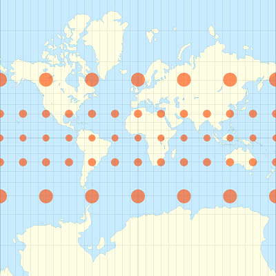

## Contenu de l'atelier en ligne

http://pmarchand1.github.io/atelier_rgeo

## Données géoréférencées

* De plus en plus nombreuses dans divers domaines (photos aériennes, images satellite, données du recensement, messages géoréférencés sur les réseaux sociaux, etc.). 

* Données matricielles: valeur à chaque point d'une grille couvrant l'espace (ex.: image satellite).

* Données vectorielles: variables associés à des lieux discrets (points, lignes, polygones).

## Pourquoi R?

Au départ, écrire un programme pour manipuler des données géographiques peut sembler moins intuitif, comparé à l'interface graphique de logiciels spécialisés comme ArcGIS.

Quelques avantages d'une analyse programmée:

* Il est facile de répéter l'analyse pour de nouvelles données en ré-exécutant le programme.

* Il est facile pour d'autres chercheurs de reproduire la méthodologie s'ils ont accès au même langage de programmation.

* Avec R, on peut extraire des variables spatiales et les combiner à d'autres analyses statistiques avec un seul programme.

## Objectifs

* Se familiariser avec les principaux packages permettant le traitement et la visualisation simple de données vectorielles (***sf***) et matricielles (***raster***) en R. 

* Effectuer des transformations de données courantes à l'aide des fonctions de ces packages.

* Connaître certains packages permettant des visualisations plus complexes: ***tmap*** pour des cartes statiques et ***mapview*** pour des cartes interactives.

## Explorer un jeu de données vectoriel

* Lire des fichiers de données vectorielles.

* Visualiser des variables sur une carte.

* Superposer plusieurs jeux de données.

## Explorer un jeu de données vectoriel

* Le package ***sf*** permet de travailler avec les données vectorielles (points, lignes et polygones) dans R.

* Lire un jeu de données: `st_read`.

* Convertir un *dataframe* en objet spatial: `st_as_sf`.

* Opérations de base des *dataframe* s'appliquent aussi aux objets *sf*.

* Visualiser sur une carte: `plot`.

* Relation d'inclusion entre objets géométriques: `st_within`.

## Systèmes de coordonnées et transformations

* Coordonnées géographiques (longitude et latitude, en degrés): requièrent un système de référence géodésique (*datum*).

* Coordonnées planes (en mètres): requièrent un système de coordonnées géographiques et une projection.

* Impossible de représenter fidèlement une surface courbe sur un plan. Différentes projections sont adaptées à des régions et des besoins précis.

## Systèmes de coordonnées et transformations

Exemple:

* Les cercles rouges sont des régions de forme et taille identiques en réalité.

* Projection de Mercator (gauche): régions de formes comparables, mais de superficie non équivalente.

* Projection équivalente de Lambert (droite); régions de superficie comparables, mais déformées.

 

## Systèmes de coordonnées et transformations

* Vérifier le système de coordonnées: `st_crs`.

* Transformer les coordonnées d'un système à un autre: `st_transform`.

## Opérations géométriques sur les données vectorielles

## Cartes thématiques avec *tmap*

https://github.com/mtennekes/tmap

## Cartes thématiques avec *tmap*

* Définir les objets géométriques à afficher: `tm_shape`.

* Ajouter des couches de données avec `+` (ex.: `tm_fill`, `tm_text`).

* Diviser en plusieurs cartes selon une variable: `tm_facets`.

## Traitement des données matricielles avec *raster*

* Exemple: Modèle d'élévation numérique du Canada (CDEM)

* Lire et visualiser des données matricielles

* Sectionner ou combiner des jeux de données matriciels

* Superposer des données vectorielles et matricielles

## Traitement des données matricielles avec *raster*

## Extraire des données matricielles à partir d'objets *sf*

* *r* est un *raster*, *pt* un point, *poly* un polygone.

* `extract(r, pt)`: Valeur de *r* au point.

* `extract(r, poly)`: Valeurs de toutes les cellules de *r* couvertes par le polygone.

* `extract(r, poly, fun = ...)`: Combine les valeurs par polygone selon la fonction donnée par `fun`.

## Pour en savoir plus

* Possibilités du package *sf* décrites au [https://r-spatial.github.io/sf/](https://r-spatial.github.io/sf/), section Articles.

* [Introduction to Working With Raster Data in R](http://neondataskills.org/tutorial-series/raster-data-series/) (formation développée par le National Ecological Observation Network)

* [Vignette du package *tmap*](https://cran.r-project.org/web/packages/tmap/vignettes/tmap-nutshell.html)

* Livre gratuit en ligne de Robin Lovelace, [*Geocomputation in R*](https://geocompr.robinlovelace.net/)

* [Liste détaillée](https://cran.r-project.org/web/views/Spatial.html) des packages d'analyse spatiale en R.
